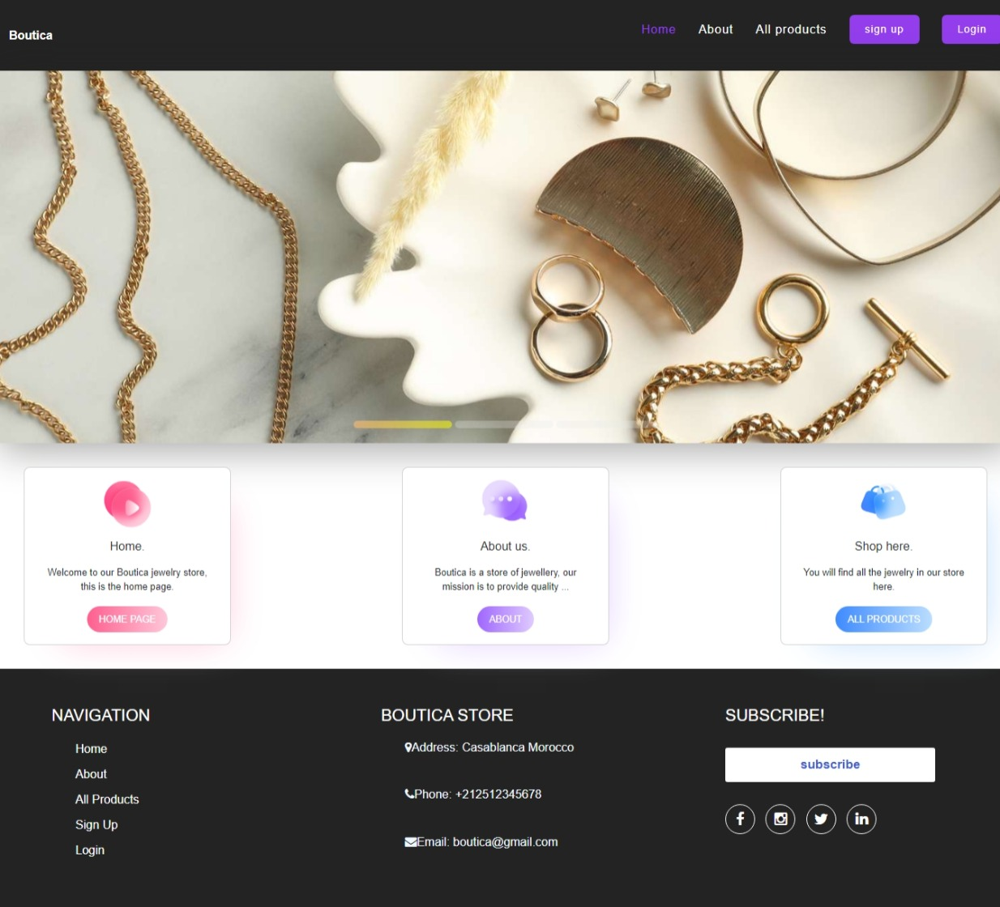

# Shop Application


# Introdcution
An online store specializing in the sale of high-quality jewelry items, offering a wide range of products including rings, necklaces, and earrings.

# Requirement

Python 3.9.0, virtualenv, mysql

# Installation

The project uses Mysql for the database, make sure to create a mysql database before proceding to the project building

````
mysql -u root

mysql> CREATE DATABASE IF NOT EXISTS Ecommerce;
Query OK, 0 rows affected (0.00 sec)

mysql> CREATE USER IF NOT EXISTS 'aichaazlf'@'localhost' IDENTIFIED BY 'password123';
Query OK, 1 row affected (0.00 sec)

mysql> GRANT ALL PRIVILEGES ON Ecommerce .* TO 'aichaazlf'@'localhost';
Query OK, 0 rows affected (0.00 sec)

mysql> GRANT SELECT ON `performance_schema`.* TO 'aichaazlf'@'localhost';
Query OK, 0 rows affected (0.00 sec)
````

Before procedding the the installation you should install virtualenv and create a new dev environement.
After that switch to your new environement and install all the project requirements

```
pip install -r requirements.txt
```

set the flask env variable
```
set FLASK_APP=app.py
```
use alembic to build the database

init : to initialize almebic migration. 
migrate: to generate the migration file. 
upgrade: run the migration file and create the tables. 

```
flask db init
flask db migrate
flask db upgrade
```
Switch to the flask shell to create an admin user.
```
flask shell
```

In the flask shell import User model and db, and initialize a new user object

```
from Ecommerce.models import User
from Ecommerce import db

admin = User(email="aicha@admin.ma", username="aicha", password=bcrypt.generate_password_hash("password123"), country="morocco", address="casablanca", phone="12345678")
```
Make the user admin
```
admin.is_admin = True
```
Add the new user to the database and commit the changes
```
db.session.add(admin)
db.session.commit()
```
exit the flask shell
```
exit()
```
Run the app

```
flask run
```

If everything went smoothly the app should be running on http://127.0.0.1:5000/

# Authors
* Aicha Azlf [Github](https://github.com/aicha652) / [Linkedin](https://www.linkedin.com/in/aicha-azlf-099148189/)
* Sara Daoumy [Github](https://github.com/sara-dme) / [Linkedin](https://www.linkedin.com/in/sara-dme-2899b6270)

# Video
* https://drive.google.com/file/d/1f8NuxTlPCG7gGF1CGyZKvy-E37an1hTq/view?usp=drive_link

# Landing page
* https://aichaazlf652.wixsite.com/boutica-3

# License
Public Domain.